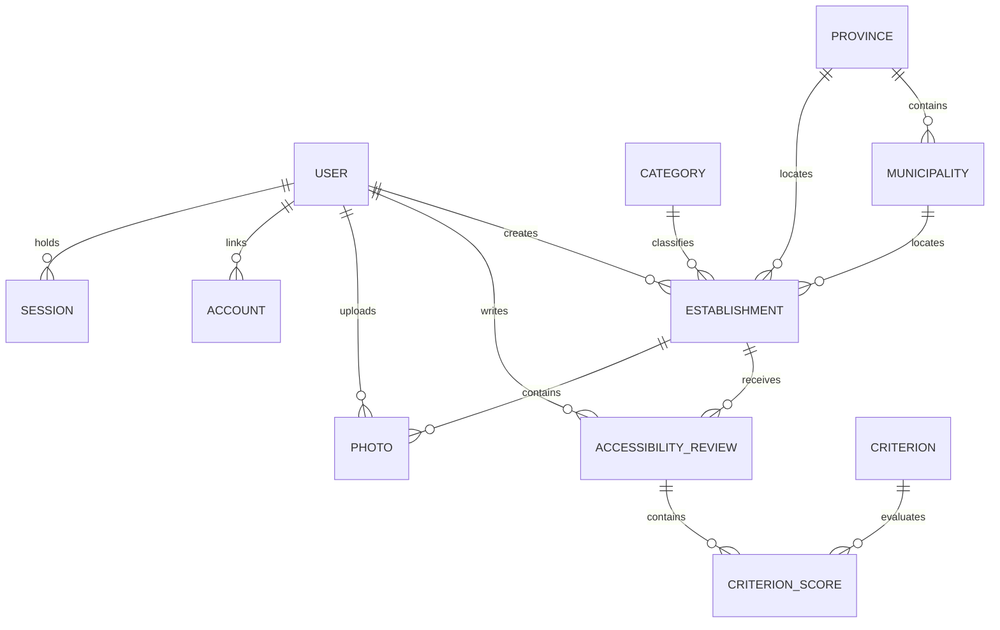

# Especificación

**ID:** SPEC-001

**Nombre:** Modelo de dominio

**Versión:** 1.1

**Estado:** Aprobada

**Dependencias:**

- 000-product-specification.md

**Bloquea:**

- 002-system-architecture.md
- 003-infrastructure.md
- 010-authentication-and-authorization.md
- 020-user-management.md
- 030-establishment-management.md
- 035-normalización-geográfica
- 040-accessibility-reviews.md
- 050-photo-management.md

---

# 1. Objetivo

Definir el modelo de dominio de Accesibilidad 360.

Este documento constituye la fuente de verdad para todas las entidades del sistema, sus relaciones, restricciones y reglas de negocio.

No contiene decisiones de implementación.

No describe tecnologías.

No define interfaces de usuario.

Las entidades técnicas de autenticación se describen aparte, en la sección 4, únicamente para delimitar qué no pertenece al dominio.

---

# 2. Principios

El modelo deberá:

- representar únicamente conceptos del negocio;
- ser independiente del framework utilizado;
- ser fácilmente ampliable;
- evitar duplicidad de información;
- mantener relaciones claras entre entidades.

---

# 3. Entidades de dominio

## User

Representa un usuario registrado en la plataforma.

Responsabilidades:

- autenticarse;
- mantener un perfil;
- crear establecimientos;
- realizar valoraciones;
- subir fotografías.

---

## Establishment

Representa un establecimiento físico.

Puede corresponder a:

- restaurante;
- bar;
- cafetería;
- comercio;
- supermercado;
- hotel;
- centro sanitario;
- centro público;
- instalación deportiva;
- etc.

Un establecimiento tiene obligatoriamente:

- una categoría;
- una provincia;
- un municipio;
- un creador (propietario inicial).

Un establecimiento puede tener:

- varias fotografías;
- varias valoraciones.

Su ubicación geográfica (latitud y longitud) puede no estar disponible.

---

## AccessibilityReview

Representa una evaluación realizada por un usuario.

Una valoración siempre pertenece a:

- un usuario;
- un establecimiento.

Cada usuario únicamente podrá tener una valoración por establecimiento.

---

## Photo

Representa una fotografía.

Una fotografía pertenece a:

- un establecimiento;
- un usuario.

El archivo vive en almacenamiento externo; en el dominio solo existen su URL y su identificador remoto.

---

## Category

Clasifica los establecimientos.

Categorías iniciales:

- Restaurante
- Bar
- Cafetería
- Comercio
- Supermercado
- Hotel
- Centro sanitario
- Centro público
- Instalación deportiva
- Otro

---

## Province

Provincia española con su código oficial del INE (2 dígitos).

Ejemplos: Madrid (28), Barcelona (08), Sevilla (41).

---

## Municipality

Municipio español con su código oficial del INE (5 dígitos).

Pertenece siempre a una provincia. Hay nombres repetidos entre provincias.

---

## Criterion

Representa un criterio de accesibilidad que puede evaluarse en un establecimiento.

Criterios iniciales, en orden de presentación:

1. Acceso sin escalones
2. Puerta accesible
3. Anchura de paso
4. Espacio de giro
5. Aseo adaptado
6. Ascensor accesible
7. Aparcamiento para personas con movilidad reducida
8. Señalización accesible

Cada criterio podrá reutilizarse en cualquier establecimiento.

Solo algunos criterios admiten la calificación «No aplicable».

---

## CriterionScore

Representa la puntuación que un usuario asigna a un criterio concreto dentro de una valoración.

Cada registro pertenece a:

- una valoración;
- un criterio.

La puntuación es un entero de 0 a 5, o nula cuando el criterio no resulta aplicable al establecimiento. Lo nulo nunca es un cero: los criterios no aplicables se excluyen de las medias.

---

# 4. Entidades técnicas (Auth.js)

No pertenecen al dominio. Existen únicamente para la autenticación y se detallan en SPEC-010, no aquí:

- `Account`: vincula un usuario con un proveedor de autenticación.
- `Session`: sesión persistente (reservada; las sesiones actuales son JWT sin persistencia).
- `VerificationToken`: tokens de un solo uso (p. ej. recuperación).

---

# 5. Relaciones

User

1:N

Establishment (como creador, obligatorio)

---

User

1:N

AccessibilityReview

---

User

1:N

Photo

---

Category

1:N

Establishment

---

Province

1:N

Municipality

---

Province

1:N

Establishment

---

Municipality

1:N

Establishment

---

Establishment

1:N

AccessibilityReview

---

Establishment

1:N

Photo

---

AccessibilityReview

1:N

CriterionScore

---

Criterion

1:N

CriterionScore

---

# 6. Atributos

## User

- id
- name
- email (único)
- emailVerified (opcional, para futura verificación)
- image (avatar, opcional)
- passwordHash (opcional; nunca texto plano)
- role (USER por defecto)
- createdAt
- updatedAt

---

## Establishment

- id
- name
- description (opcional)
- address
- postalCode (opcional)
- latitude (opcional; nula si la geocodificación no la obtuvo)
- longitude (opcional; nula si la geocodificación no la obtuvo)
- provinceId
- municipalityId
- categoryId
- createdById
- createdAt
- updatedAt

No existe puntuación persistida: las medias se calculan dinámicamente y nunca se almacenan.

---

## AccessibilityReview

- id
- establishmentId
- userId
- comment (opcional; opinión general del establecimiento)
- createdAt
- updatedAt

Unicidad: un usuario, una valoración por establecimiento.

---

## Photo

- id
- establishmentId
- userId
- url
- publicId (identificador remoto, para futuras operaciones)
- caption (opcional, reservado)
- isPrimary (prepara múltiples futuras)
- createdAt

---

## Category

- id
- name (único)
- icon (opcional, reservado)
- createdAt

---

## Province

- id
- code (código INE de 2 dígitos, único)
- name (denominación oficial, única)

---

## Municipality

- id
- provinceId
- code (código INE de 5 dígitos, único)
- name

Unicidad: nombre único dentro de su provincia.

---

## Criterion

- id
- name (único)
- description (opcional)
- order (orden de presentación)
- allowsNotApplicable (solo algunos criterios)
- createdAt

---

## CriterionScore

- id
- reviewId
- criterionId
- score (entero 0–5, o nulo si «No aplicable»)

Unicidad: un criterio, una puntuación por valoración.

---

# 7. Reglas de negocio

## Usuarios

Un email debe ser único.

Un usuario puede eliminar su cuenta.

No puede eliminar contenido perteneciente a otros usuarios.

Solo el creador o un administrador puede editar o eliminar un establecimiento.

---

## Establecimientos

El nombre es obligatorio.

La dirección, la provincia y el municipio son obligatorios (normalizados, sin texto libre).

Debe pertenecer a una categoría.

La ubicación geográfica es opcional: sin coordenadas no hay mapa, pero la ficha sigue siendo válida.

---

## Valoraciones

Un usuario únicamente puede tener una valoración por establecimiento.

Una valoración exige puntuar todos los criterios: con número (0–5) o con «No aplicable» donde esté permitido.

No podrá valorarse un establecimiento inexistente.

---

## Fotografías

Las fotografías deberán estar asociadas a un establecimiento.

En esta versión, un establecimiento admite una única fotografía.

---

## Criterios de accesibilidad

Los criterios son comunes para toda la aplicación.

Cada criterio puede utilizarse en miles de valoraciones.

---

## Escala de puntuación

- 0 Muy deficiente
- 1 Deficiente
- 2 Aceptable
- 3 Buena
- 4 Muy buena
- 5 Excelente

Las puntuaciones nulas («No aplicable») nunca entran en las medias.

Ejemplo: 5, 5, 4 y un «No aplicable» dan (5 + 5 + 4) / 3, nunca / 4.

---

# 8. Enumeraciones

## Role

- USER
- MODERATOR
- ADMIN

Todos los nuevos usuarios reciben USER.

---

# 9. Eventos de dominio

El sistema deberá contemplar los siguientes eventos:

UserRegistered

UserUpdated

EstablishmentCreated

EstablishmentUpdated

EstablishmentDeleted

ReviewCreated

ReviewUpdated

PhotoUploaded

PhotoDeleted

Aunque inicialmente no exista un sistema de eventos, estos conceptos forman parte del dominio.

---

# 10. Restricciones

No podrán existir:

- usuarios duplicados;
- categorías duplicadas;
- criterios duplicados;
- provincias duplicadas;
- municipios duplicados dentro de su provincia;
- valoraciones duplicadas (mismo usuario y establecimiento);
- puntuaciones duplicadas (misma valoración y criterio);
- fotografías sin establecimiento;
- establecimientos sin categoría, provincia, municipio o creador.

---

# 11. Diagrama del dominio

---

# 12. Glosario

**Establecimiento**

Lugar físico susceptible de ser visitado por usuarios.

---

**Valoración**

Opinión estructurada sobre la accesibilidad de un establecimiento.

---

**Accesibilidad**

Grado en que un establecimiento puede ser utilizado por personas con discapacidad o movilidad reducida.

---

**Provincia**

División territorial oficial (código INE) a la que pertenece un establecimiento.

---

**Municipio**

Localidad oficial (código INE) donde se sitúa un establecimiento.

---

**Criterio**

Aspecto concreto de accesibilidad evaluable, reutilizable en cualquier establecimiento.

---

**Fotografía**

Imagen de un establecimiento, almacenada externamente y referenciada por URL.

---

**No aplicable**

Calificación de un criterio que, por la naturaleza del establecimiento, no le resulta aplicable. No es un cero y no interviene en las medias.

---

# 13. Definition of Ready

El modelo estará listo para implementarse cuando:

- todas las entidades estén definidas;
- todas las relaciones estén documentadas;
- todas las reglas de negocio estén identificadas.

---

# 14. Definition of Done

Esta especificación se considerará finalizada cuando:

- permita generar el esquema de base de datos;
- permita generar los tipos TypeScript;
- permita implementar Prisma sin ambigüedades;
- no existan entidades pendientes de definir.
