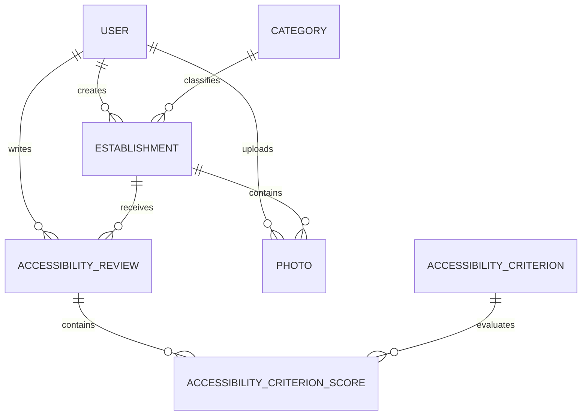

# Especificación

**ID:** SPEC-001

**Nombre:** Modelo de dominio

**Versión:** 1.0

**Estado:** Aprobada

**Dependencias:**

- 000-product-specification.md

**Bloquea:**

- 002-infrastructure.md
- 010-user-authentication.md
- 020-user-management.md
- 030-establishment-management.md

---

# 1. Objetivo

Definir el modelo de dominio de Accesibilidad 360.

Este documento constituye la fuente de verdad para todas las entidades del sistema, sus relaciones, restricciones y reglas de negocio.

No contiene decisiones de implementación.

No describe tecnologías.

No define interfaces de usuario.

---

# 2. Principios

El modelo deberá:

- representar únicamente conceptos del negocio;
- ser independiente del framework utilizado;
- ser fácilmente ampliable;
- evitar duplicidad de información;
- mantener relaciones claras entre entidades.

---

# 3. Entidades

El dominio estará compuesto inicialmente por las siguientes entidades.

## User

Representa un usuario registrado en la plataforma.

Responsabilidades:

- autenticarse;
- mantener un perfil;
- crear establecimientos;
- realizar valoraciones;
- subir fotografías.

---

## Establishment

Representa un establecimiento físico.

Puede corresponder a:

- restaurante;
- cafetería;
- comercio;
- centro sanitario;
- edificio público;
- hotel;
- museo;
- etc.

Un establecimiento puede tener:

- varias fotografías;
- varias valoraciones;
- un propietario (opcional).

---

## AccessibilityReview

Representa una evaluación realizada por un usuario.

Una valoración siempre pertenece a:

- un usuario;
- un establecimiento.

Cada usuario únicamente podrá tener una valoración activa por establecimiento.

---

## Photo

Representa una fotografía.

Una fotografía pertenece a:

- un establecimiento;
- un usuario.

---

## Category

Clasifica los establecimientos.

Ejemplos:

- Restauración
- Comercio
- Administración
- Sanidad
- Educación
- Turismo
- Ocio

---

# 4. Relaciones

User

1:N

Establishment

---

User

1:N

AccessibilityReview

---

User

1:N

Photo

---

Category

1:N

Establishment

---

Establishment

1:N

AccessibilityReview

---

Establishment

1:N

Photo

---

AccessibilityReview

1:N

AccessibilityCriterionScore

---

AccessibilityCriterion

1:N

AccessibilityCriterionScore

---

# 5. Atributos

## User

- id
- name
- email
- password
- role
- avatar
- createdAt
- updatedAt

---

## Establishment

- id
- name
- description
- address
- postalCode
- city
- province
- latitude
- longitude
- accessibilityScore
- category
- createdBy
- createdAt
- updatedAt

---

## AccessibilityReview

- id
- establishmentId
- userId
- comment
- createdAt
- updatedAt

El comentario de la valoración representa una opinión general del establecimiento.

Las observaciones específicas de cada aspecto de accesibilidad se almacenarán en los correspondientes `AccessibilityCriterionScore`.

---

## Photo

- id
- establishmentId
- userId
- url
- caption
- createdAt

---

## Category

- id
- name
- icon

---

## AccessibilityCriterion

Representa un criterio de accesibilidad que puede evaluarse en un establecimiento.

Ejemplos:

- Acceso sin escalones
- Puertas accesibles
- Ascensor
- Aseo adaptado
- Aparcamiento PMR
- Espacios de giro
- Mostrador accesible
- Señalización accesible

Cada criterio podrá reutilizarse en cualquier establecimiento.

Atributos:

- id
- code
- name
- description
- icon
- weight
- active
- applicableByDefault

---

## AccessibilityCriterionScore

Representa la puntuación que un usuario asigna a un criterio concreto dentro de una valoración.

Cada registro pertenece a:

- una valoración;
- un criterio.

Además de la puntuación, el usuario puede añadir un comentario opcional para aportar contexto sobre ese aspecto concreto de la accesibilidad.

Atributos:

- id
- reviewId
- criterionId
- score
- comment

---

# 6. Reglas de negocio

## Usuarios

Un email debe ser único.

Un usuario puede eliminar su cuenta.

No puede eliminar contenido perteneciente a otros usuarios.

---

## Establecimientos

El nombre es obligatorio.

La ubicación es obligatoria.

Debe pertenecer a una categoría.

No podrá existir un establecimiento duplicado en la misma dirección.

---

## Valoraciones

Un usuario únicamente puede tener una valoración por establecimiento.

Una valoración podrá modificarse.

No podrá valorarse un establecimiento inexistente.

---

## Fotografías

Las fotografías deberán estar asociadas a un establecimiento.

Podrán eliminarse por:

- propietario;
- moderador;
- administrador.

---

## Criterios de accesibilidad

Los criterios son comunes para toda la aplicación.

Cada criterio puede utilizarse en miles de valoraciones.

Un criterio podrá desactivarse sin eliminar el histórico.

El peso del criterio permitirá calcular el Índice de Accesibilidad.

---

## AccessibilityScore

- 0 Muy deficiente
- 1 Deficiente
- 2 Aceptable
- 3 Buena
- 4 Muy buena
- 5 Excelente

---

## Puntuaciones de criterios

Cada criterio evaluado deberá tener una puntuación.

El comentario será opcional.

La puntuación deberá estar comprendida entre 0 y 5.

Una valoración podrá contener tantos criterios como estén activos en el sistema.

Los comentarios deberán referirse únicamente al criterio evaluado y no al establecimiento en general.

---

# 7. Enumeraciones

## UserRole

- USER
- MODERATOR
- ADMIN

---

# 8. Eventos de dominio

El sistema deberá contemplar los siguientes eventos:

UserRegistered

UserUpdated

EstablishmentCreated

EstablishmentUpdated

ReviewCreated

ReviewUpdated

PhotoUploaded

PhotoDeleted

Aunque inicialmente no exista un sistema de eventos, estos conceptos forman parte del dominio.

---

# 9. Restricciones

No podrán existir:

- usuarios duplicados;
- categorías duplicadas;
- valoraciones duplicadas;
- fotografías sin establecimiento;
- establecimientos sin categoría.

---

# 10. Diagrama del dominio

---

# 11. Glosario

**Establecimiento**

Lugar físico susceptible de ser visitado por usuarios.

---

**Valoración**

Opinión estructurada sobre la accesibilidad de un establecimiento.

---

**Accesibilidad**

Grado en que un establecimiento puede ser utilizado por personas con discapacidad o movilidad reducida.

---

# 12. Definition of Ready

El modelo estará listo para implementarse cuando:

- todas las entidades estén definidas;
- todas las relaciones estén documentadas;
- todas las reglas de negocio estén identificadas.

---

# 13. Definition of Done

Esta especificación se considerará finalizada cuando:

- permita generar el esquema de base de datos;
- permita generar los tipos TypeScript;
- permita implementar Prisma sin ambigüedades;
- no existan entidades pendientes de definir.