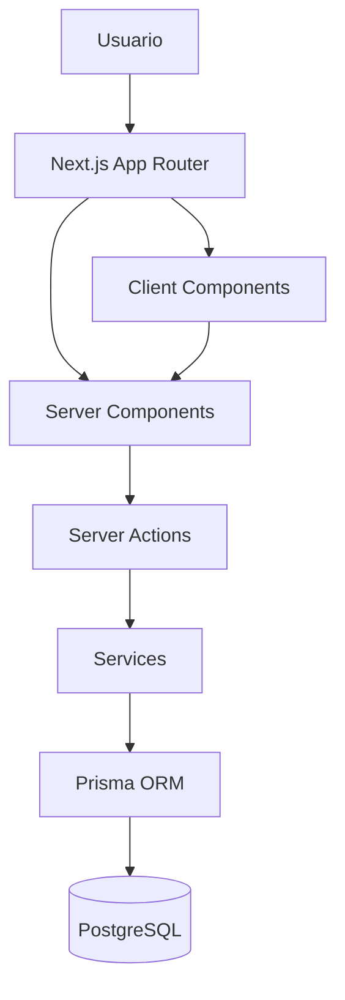

# Especificación

**ID:** SPEC-002

**Nombre:** Arquitectura del sistema

**Versión:** 1.0

**Estado:** Aprobada

**Dependencias:**

- 000-product-specification.md
- 001-domain-model.md

**Bloquea:**

- 003-infrastructure.md
- Todas las especificaciones funcionales.

---

# 1. Objetivo

Definir la arquitectura técnica que deberá seguir todo el proyecto.

Este documento establece la organización del código, el flujo de datos, las responsabilidades de cada capa y las decisiones arquitectónicas que deberán respetarse durante todo el desarrollo.

No contiene detalles de implementación.

---

# 2. Objetivos de la arquitectura

La arquitectura deberá ser:

- Modular.
- Escalable.
- Fácil de mantener.
- Fácil de probar.
- Fácil de desplegar.
- Independiente de la interfaz de usuario.
- Independiente de la base de datos siempre que sea posible.

---

# 3. Stack tecnológico

## Framework

Next.js 15 (App Router)

## Lenguaje

TypeScript

Modo estricto obligatorio.

## Estilos

Tailwind CSS

## Componentes

shadcn/ui

## Base de datos

PostgreSQL

## ORM

Prisma

## Validación

Zod

## Formularios

React Hook Form

## Autenticación

Auth.js

## Mapas

Leaflet + OpenStreetMap

## Testing

Vitest

React Testing Library

Playwright

---

# 4. Arquitectura general

La aplicación seguirá una arquitectura modular basada en funcionalidades.

Cada módulo será responsable de:

- componentes;
- acciones;
- lógica de negocio;
- validaciones;
- pruebas.

No se utilizará una arquitectura organizada únicamente por tipo de archivo.

---

# 5. Organización del proyecto

```
app/
components/
features/
lib/
hooks/
types/
config/
prisma/
tests/
docs/
public/
```

Cada directorio tendrá una responsabilidad claramente definida.

---

# 6. Organización por módulos

Cada módulo seguirá esta estructura cuando sea necesario:

```
feature/

components/

actions/

services/

schemas/

hooks/

types/

utils/

tests/
```

No deberán crearse carpetas vacías.

---

# 7. Responsabilidades

## app/

Contiene exclusivamente:

- rutas;
- layouts;
- páginas;
- loading;
- error;
- route handlers.

No contendrá lógica de negocio.

---

## features/

Contiene la implementación de cada dominio funcional.

Toda la lógica específica deberá residir aquí.

---

## components/

Componentes reutilizables para toda la aplicación.

---

## lib/

Servicios compartidos.

Ejemplos:

- autenticación;
- base de datos;
- utilidades;
- permisos;
- logger.

---

## prisma/

Esquema de base de datos.

Migraciones.

Seeds.

---

## tests/

Pruebas globales del proyecto.

---

# 8. Flujo de datos

Siempre que sea posible:

```
Server Component

↓

Server Action

↓

Service

↓

Prisma

↓

PostgreSQL
```

Evitar peticiones HTTP internas entre componentes del mismo proyecto.

---

# 9. Server Components

Los Server Components serán la opción por defecto.

Los Client Components solo se utilizarán cuando exista una necesidad real.

Ejemplos:

- mapas;
- formularios complejos;
- modales;
- drag and drop.

---

# 10. Server Actions

Se utilizarán para:

- crear;
- editar;
- eliminar;
- operaciones iniciadas mediante formularios.

---

# 11. Route Handlers

Se utilizarán únicamente para:

- APIs públicas;
- integraciones futuras;
- webhooks.

No deberán sustituir a las Server Actions.

---

# 12. Acceso a datos

Toda interacción con la base de datos deberá realizarse mediante Prisma.

No se utilizará SQL directo salvo necesidad justificada.

---

# 13. Validación

Toda entrada deberá validarse mediante Zod.

Las validaciones del cliente mejoran la experiencia.

Las validaciones del servidor garantizan la seguridad.

Ambas podrán coexistir.

---

# 14. Gestión del estado

Se priorizará el estado nativo de React.

No utilizar Redux.

Evitar duplicar estado entre servidor y cliente.

---

# 15. Manejo de errores

Los errores deberán:

- registrarse;
- tratarse correctamente;
- no mostrar información técnica al usuario.

---

# 16. Seguridad

Toda operación sensible deberá validar:

- autenticación;
- autorización;
- integridad de los datos.

Nunca confiar únicamente en validaciones del cliente.

---

# 17. Accesibilidad

Toda interfaz deberá cumplir buenas prácticas WCAG.

La accesibilidad forma parte de la arquitectura del sistema.

No constituye una funcionalidad independiente.

---

# 18. Rendimiento

Priorizar las capacidades nativas de Next.js.

No introducir optimizaciones prematuras.

Evitar dependencias innecesarias.

---

# 19. Diagrama arquitectónico



---

# 20. Restricciones

No utilizar:

- Redux.
- CSS Modules.
- JavaScript.
- SQL directo.
- APIs internas innecesarias.
- Componentes gigantes.
- Hooks sin reutilización.
- Dependencias no justificadas.

---

# 21. Definition of Ready

La arquitectura estará lista para implementarse cuando:

- el dominio esté aprobado;
- las decisiones arquitectónicas estén documentadas;
- las responsabilidades estén claramente definidas.

---

# 22. Definition of Done

Esta especificación se considerará finalizada cuando permita:

- crear la estructura del proyecto;
- implementar la infraestructura;
- comenzar el desarrollo de funcionalidades sin ambigüedades.